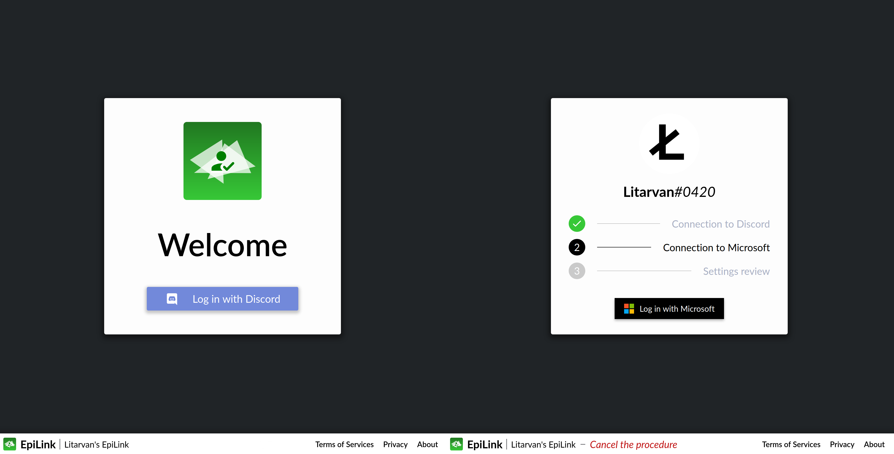

# EpiLink 🔗

[-lightgray?style=for-the-badge)](LICENSE)
 

**Links:** [Documentation](https://epilink.zoroark.guru) | [Changelog](/CHANGELOG.md) | [Discord server](https://discord.gg/CpHmSUt)

EpiLink is an account verification server, allowing you to link a Discord identity to any OpenID Provider (including Microsoft, Google...)
identity.

EpiLink is available under the Mozilla Public License 2.0 (no copyleft exception) `MPL-2.0-no-copyleft-exception` [(info)](LICENSE).

## Requirements

- Java JDK >= 11, both for building and running. Do NOT use Oracle's JRE/JDK (licensing concerns), consider using AdoptOpenJDK instead.

(NPM and Gradle are downloaded automatically if you don't have them installed on your system)

## Developing, running and building

Check [this page](https://epilink.zoroark.guru/#/Developing) for information.

## I need help!

Feel free to open an issue if you have any question on this project. Make sure to read the [documentation](https://epilink.zoroark.guru) too, you have a lot of information there!