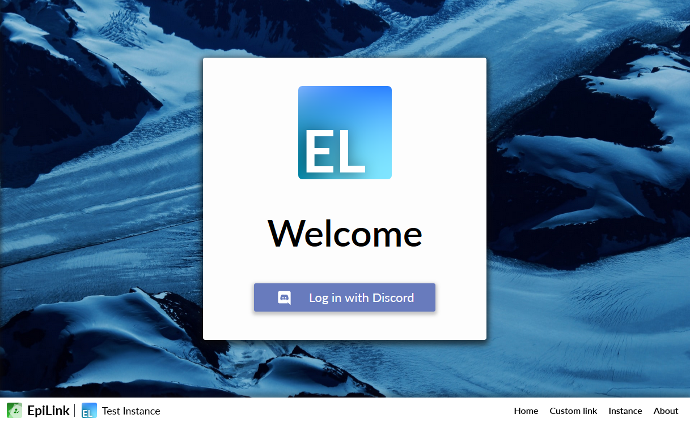
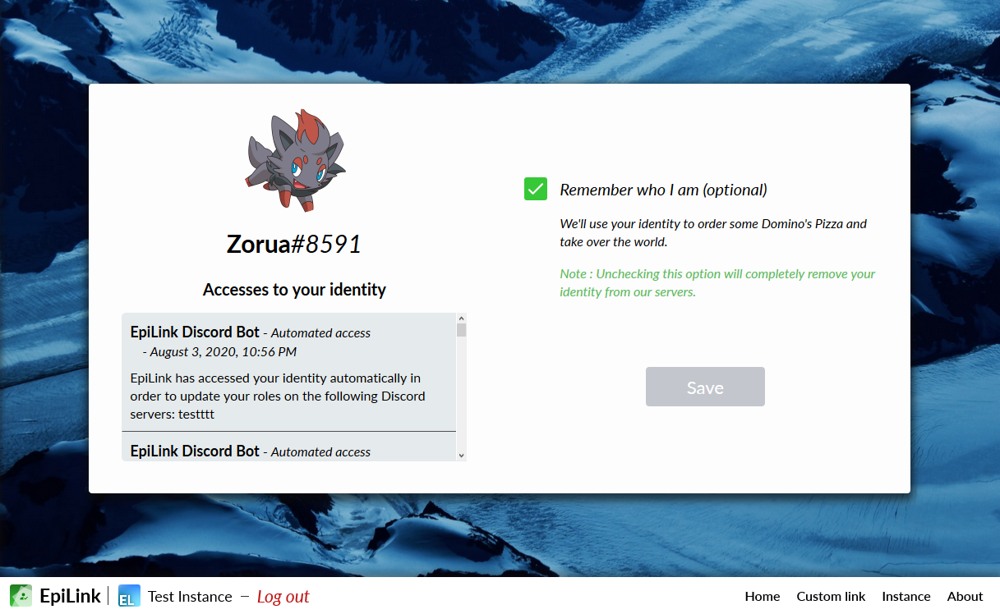

# EpiLink

EpiLink is an authentication server and Discord bot that:

* Links Discord account to any OpenID Connect-compatible service accounts (Microsoft/Azure AD, Google, ...)
* Automatically attributes roles based on who is known or not
* Automatically attributes roles based on [e-mail addresses](Rulebooks.md#e-mail-validation) and even [HTTPS requests](Rulebooks.md#rules)
* Has a nice web front-end so that users can control their accounts
* Automatically notifies users whenever their identity has been accessed ([can be disabled](MaintainerGuide.md#privacy-configuration))

EpiLink is [open-source](https://github.com/EpiLink/EpiLink) (under the [MPL 2](https://github.com/EpiLink/EpiLink/tree/master/LICENSE), with the "Incompatible with Secondary License" clause) 

## Advisory

For any question regarding EpiLink, ask your instance maintainer first! They may have modified EpiLink. If you are the maintainer and encounter some issue, ask your question on the [bug tracker](https://github.com/EpiLink/EpiLink/issues).

!> A distinction must be made between "EpiLink" and an "EpiLink Instance". **EpiLink** is the software project, made of code and documentation. The project is managed by the dev team. It is given with no warranties of any kind. An **EpiLink Instance** is an individual deployment of EpiLink, a running server. The instance itself is ran by people who are not necessarily the developers of EpiLink. The people running an EpiLink Instance are "instance maintainers".

**It is the instance maintainers' responsibility to handle all GDPR related
requests and concerns and to come up with and apply terms of services.**

EpiLink is built with :heart: by [Zoroark](https://github.com/utybo) and [Litarvan](https://github.com/Litarvan)

## Screenshots 

### Home page

### Profile page

### Instance page

